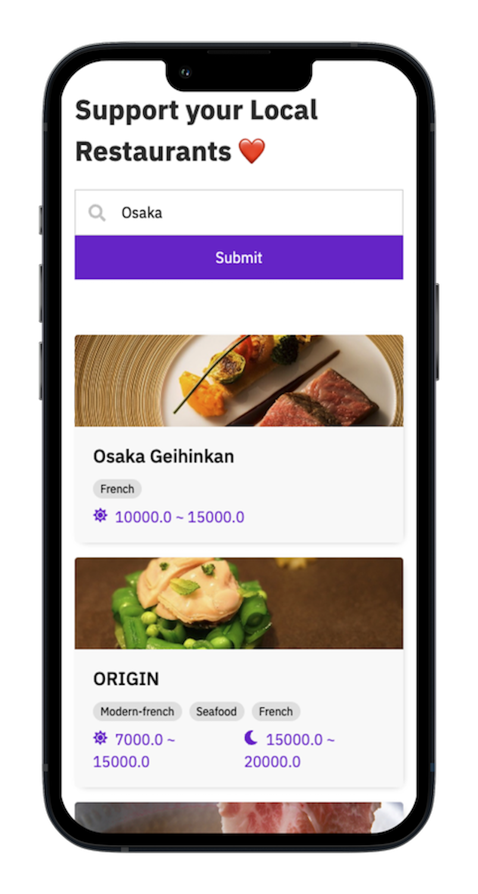

# TableCheck's Assignment

SPA that allows users to look for restaurants in Japan and displays information about them and how to go.

APP: [tircheck.shop](https://tircheck.shop/en)

  

## Additional configuration

Restaurant's data is provided by the TableCheck API.
Map is displayed for each restaurant with the Mapbox API.

Apart from the pre-installed packages in the boilerplate, the following were used:

- axios
- mapbox-gl
- cypress
- react-icons

Environment variables must be set in a .env file:

- RAZZLE_API (TableCheck API)
- RAZZLE_MAPBOX_TOKEN

## Features

- Main tech stack: React, TypeScript, Emotion, i18n
- Tablekit integration with FontAwesome icons and Dark Mode
- Maps Integration with Mapbox
- Basic localized routing
- Basic layout with footer, top and side navs
- Language Selection
- Responsive
- Basic FormSpree contact form

## Getting started

- Install [Node.js](https://nodejs.org/en/download/) and [NVM](https://github.com/nvm-sh/nvm#installing-and-updating)
- Fork/Clone this project
- Run `nvm use` (will use the correct Node.js version)
- Run `npm i --legacy-peer-deps` (will install the dependencies)
- Run `npm start` (will start the app in http://localhost:3000/)

## Deploy to production

The boilerplate is configured to be deployed to [Netlify](https://netlify.com), but it can also work with Github pages,
Vercel, AWS Amplify, etc.

Instructions for a Netlify setup:

- Click on `New site from Git`
- Select `Github` and the repository where you forked it
- Change Publish directory to `build/public`
- Change the Build command to `CI= npm run build`
- Deploy site
- You can change the URL name on `Site settings > Change site name`

## Caveats

- At some point, if the project becomes a real product, all the files in `/public/static/img` and `/public/static/fonts`
  should be removed and loaded from a CDN
- The CDN URL should be specified in `/config/default.json`

## Upgrade

To upgrade this boilerplate and use the latest configuration and dependencies, please run this command and select SPA
when asked:

`npx --legacy-peer-deps -p @tablecheck/scripts tablecheck-scripts init`

## Support

Create an issue in the Github repository

## Resources

- [i18n Manager](https://www.electronjs.org/apps/i18n-manager): helpful editor for the translations

## Contributing

Pull requests are welcome. For major changes, please open an issue first to discuss what you
would like to change. Please make sure to update tests as appropriate.

## About Us

SPA Boilerplate is made with ❤️ by [TableCheck](https://www.tablecheck.com/en/join/),
the leading restaurant reservation and guest management app maker. If **you** are a
ninja-level 🥷 coder (Javascript / Ruby / Elixir / Python / Go), designer, product manager,
data scientist, QA, etc. and are ready to join us in Tokyo, Japan or work remotely,
please get in touch at [careers@tablecheck.com](mailto:careers@tablecheck.com)
or [careers.tablecheck.com](https://careers.tablecheck.com).

## License

SPA Boilerplate is licensed under the MIT license.

## Copyright

Copyright (c) 2022 TableCheck Inc.

Text Fonts from [IBM](https://github.com/IBM/plex/releases/)
